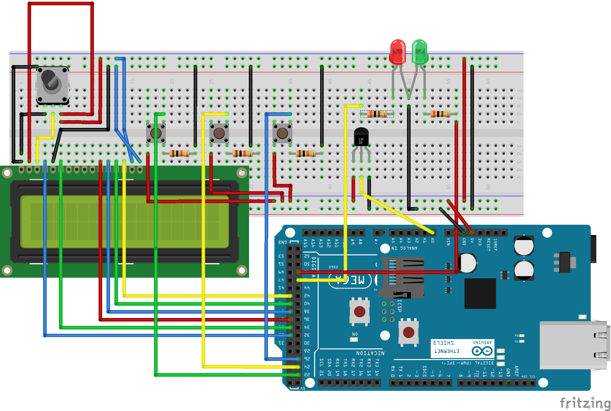

# Critical Temperature Monitor

**Note:** This project was developed as part of a university course assignment in 2015/2016.  
It is archived here for historical and portfolio purposes.

> ⚡ Important: Documentation and code comments have been translated to English for better accessibility.

## Project Description

This project implements a critical temperature monitoring system using:

- Arduino Mega 2560
- Ethernet Shield
- Temperature Sensor (connected to pin A0)
- 16x2 LCD Display (connected to pins 33–43)
- Physical control buttons (increase, decrease, activate monitoring)
- Status indicator LEDs

The system allows the user to adjust the critical temperature threshold (`tempSet`) directly through physical buttons.  
When the measured temperature (`tempData`) exceeds this threshold, an alert is triggered:

- An email and push notification are sent.
- A new row is automatically logged in a Google Sheets spreadsheet.

These actions are managed via the free **PushingBox** service, which received HTTP requests from the Arduino and securely forwarded them via HTTPS to the destination services.

> ⚠️ Note: At the time, the Arduino Mega 2560 with Ethernet Shield did not natively support HTTPS connections.  
> PushingBox was used as an intermediary to enable secure forwarding.

> ⚠️ Additional Note: The PushingBox service may no longer be active (or not work properly) today.  
> To replicate this project nowadays, it is recommended to use alternatives such as:
> - Custom Webhooks
> - IFTTT automations
> - Direct database integrations

This project was designed as a **proof of concept**, demonstrating how to integrate simple hardware with free cloud services for real-time monitoring.

## Hardware Used

| Component                | Description                          |
|---------------------------|--------------------------------------|
| Arduino Mega 2560         | Main microcontroller                |
| Ethernet Shield           | Network communication (PushingBox)  |
| Temperature Sensor        | E.g., LM35, connected to A0          |
| 16x2 LCD Display          | Displays status and temperature     |
| Physical buttons          | Manual control (UP, DOWN, OK)        |
| Indicator LEDs            | Status indicators                   |
| Cables and Breadboard     | Circuit assembly                    |
| Internet connection       | Via Ethernet cable                  |

## Project Structure

- `src/` — Main project code (`critical_temperature_monitor.ino`)
- `extras/` — Older development versions and tests (not included in the final version)
- `docs/` — Project documents (proposal, final report, presentation, schematics)
- `images/` — Hardware photos and screenshots

## Schematic Diagram

Below is the system's schematic diagram:

## How to Run

1. Clone this repository.
2. Open the `critical_temperature_monitor.ino` file in the Arduino IDE.
3. Set your PushingBox `DeviceID` in the code (look for `YOUR_DEVICE_ID`).
4. Upload the code to the Arduino Mega 2560.
5. Connect the Arduino to the internet using the Ethernet Shield.
6. Adjust the critical temperature threshold using the physical buttons (`+` and `-`).
7. Press the OK button to start monitoring.

When the measured temperature exceeds the threshold, the system will automatically trigger alerts.

## Requirements

- Arduino IDE (compatible with Arduino Mega 2560)
- Functional Ethernet Shield
- PushingBox account (or alternative service)
- Network with internet access

## License

This project is licensed under the Apache 2.0 License — see the [LICENSE](LICENSE) file for details.

---

Project archived preserving its original content and historical purpose.