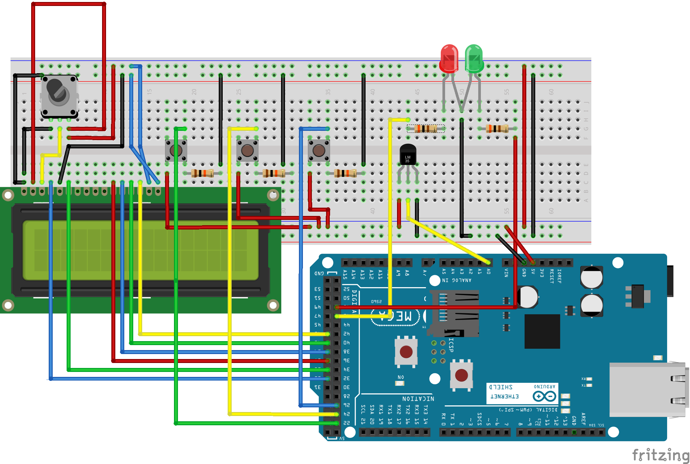

# Monitor de Temperatura Crítica

**Nota:** Este projeto foi desenvolvido como parte de um trabalho acadêmico universitário em 2015/2016.  
Está sendo arquivado aqui para fins históricos e de portfólio.

> ⚡ Importante: A documentação e os comentários no código foram traduzidos para inglês para acessibilidade internacional.

## Descrição do Projeto

Este projeto implementa um sistema de monitoramento de temperatura crítica utilizando:

- Arduino Mega 2560
- Shield Ethernet
- Sensor de Temperatura (conectado no pino A0)
- Display LCD 16x2 (conectado nos pinos 33–43)
- Botões de controle (aumentar, diminuir e ativar monitoramento)
- LEDs de indicação de estado

O sistema permite que o usuário ajuste a temperatura crítica (`tempSet`) diretamente nos botões físicos.  
Quando a temperatura medida (`tempData`) ultrapassa esse valor, um alerta é disparado:

- Um alerta é enviado por e-mail e notificação push.
- Uma linha é automaticamente registrada em uma planilha Google Sheets.

Estas ações são gerenciadas através do serviço gratuito **PushingBox**, que recebia requisições HTTP do Arduino e repassava via HTTPS para os serviços de destino.

> ⚠️ Observação: O Arduino Mega 2560 com Ethernet Shield da época não suportava conexões HTTPS.  
> O PushingBox foi utilizado como intermediário para possibilitar a comunicação segura.

> ⚠️ Nota adicional: O serviço PushingBox pode não estar mais ativo (ou não funcionar bem atualmente).  
> Para replicar o projeto hoje, recomenda-se usar alternativas como:
> - Webhooks próprios
> - Integrações via IFTTT
> - Integrações diretas com bancos de dados

Este projeto foi uma **prova de conceito**, focada em integrar hardware simples com serviços em nuvem gratuitos para monitoramento em tempo real.

## Hardware Utilizado

| Componente             | Descrição                        |
|-------------------------|----------------------------------|
| Arduino Mega 2560       | Microcontrolador principal       |
| Shield Ethernet         | Comunicação de rede (PushingBox) |
| Sensor de Temperatura   | Ex.: LM35, conectado no A0        |
| Display LCD 16x2        | Exibe status e temperatura       |
| Botões físicos          | Controle manual (UP, DOWN, OK)   |
| LEDs                    | Indicadores de estado            |
| Cabos e Protoboard      | Montagem do circuito             |
| Conexão de Internet     | Via cabo Ethernet                |

## Estrutura do Projeto

- `src/` — Código principal (`critical_temperature_monitor.ino`)
- `extras/` — Códigos antigos e versões de testes (não utilizados na recuperação atual)
- `docs/` — Documentos do projeto (proposta, relatório final, apresentação, esquemáticos)
- `images/` — Fotos do hardware e capturas de tela

## Esquemático do Projeto

Abaixo está o diagrama de montagem:

## Como Rodar

1. Clone este repositório.
2. Abra o arquivo `critical_temperature_monitor.ino` na IDE Arduino.
3. Configure o seu `DeviceID` do PushingBox no código (procure `YOUR_DEVICE_ID`).
4. Faça upload do código para o Arduino Mega 2560.
5. Conecte o Arduino à internet usando o Shield Ethernet.
6. Ajuste a temperatura crítica utilizando os botões físicos (`+` e `-`).
7. Pressione o botão OK para iniciar o monitoramento.

Quando a temperatura medida ultrapassar o valor ajustado, o sistema enviará automaticamente os alertas configurados.

## Requisitos

- Arduino IDE (versão compatível com Arduino Mega 2560)
- Shield Ethernet funcional
- Conta no PushingBox (ou serviço alternativo)
- Rede com acesso à Internet

## Licença

Este projeto está licenciado sob a Licença Apache 2.0 — consulte o arquivo [LICENSE](LICENSE) para mais detalhes.

---

Projeto arquivado preservando seu conteúdo e propósito original.